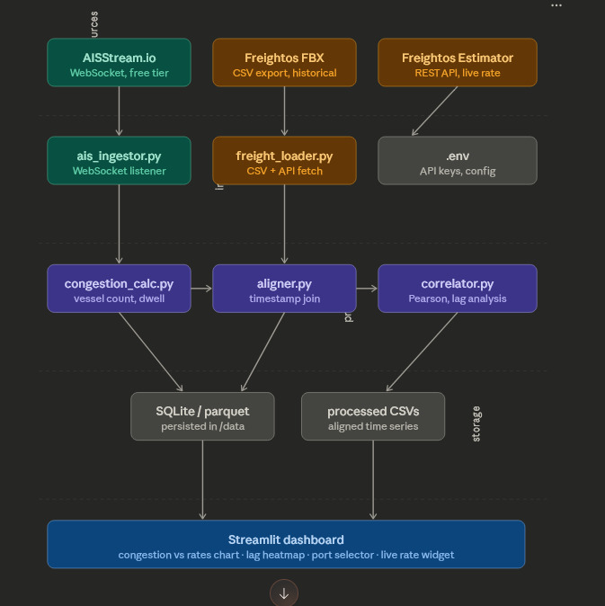
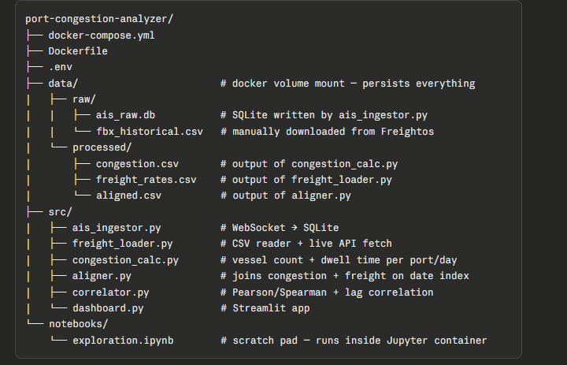
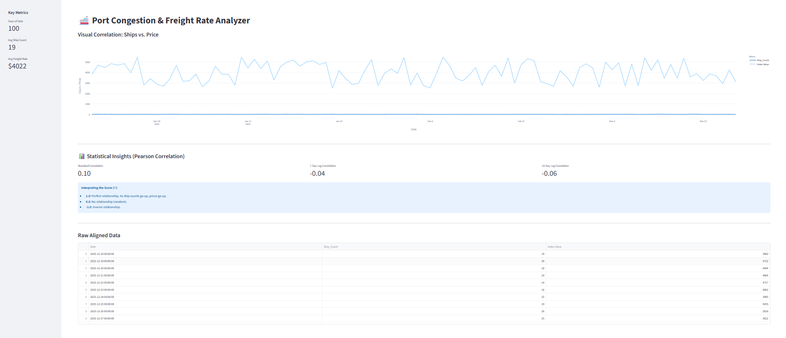

Port Congestion and Freight Rate Correlation Analyzer 🚢
An end-to-end data engineering pipeline designed to analyze the correlation between real-time port congestion (AIS data) and global freight rate fluctuations. This project utilizes a containerized micro-pipeline architecture to ingest, process, and visualize maritime data.

## 🏗️ System Architecture
The project follows a modular "Ingest-Process-Analyze" flow. By separating data collection from statistical analysis, the system ensures data integrity and scalability.

## 📂 Project Structure
The repository is organized to maintain a clear distinction between raw data, processed assets, and functional code.

## 🛠️ Tech Stack

Language: Python 3.10

Infrastructure: Docker & Docker Compose

Database: SQLite3 (Maritime pings)

Analysis: Pandas, NumPy, SciPy (Pearson Correlation)

Visualization: Streamlit, Plotly

## ⚙️ Setup & Installation
1. Prerequisites
Docker Desktop installed and running.

An API Key from AISStream.io.

2. Configuration
Create a .env file in the root directory:

Code snippet
AISSTREAM_API_KEY=your_actual_key_here
3. Build & Launch
Bash
# Build the container environment
docker compose build

# Start the services (Dashboard and Jupyter)
docker compose up -d
🚀 The Data Pipeline
To generate the final analysis, execute the following scripts in order:

Ingestion: Collect live maritime data.
docker compose exec jupyter python -u src/ais_ingestor.py

Normalization: Process freight rate CSVs.
docker compose exec jupyter python -u src/freight_loader.py

Aggregation: Calculate daily congestion scores.
docker compose exec jupyter python -u src/congestion_calc.py

Alignment: Join datasets on a common date index.
docker compose exec jupyter python -u src/aligner.py

📊 Results & Dashboard
The final output is an interactive dashboard accessible at http://localhost:8501.

!

Statistical Insights
The analyzer calculates the Pearson Correlation Coefficient to determine the relationship between vessel density and pricing. It specifically looks for Time Lag, testing if congestion today predicts freight spikes 7, 14, or 21 days into the future.